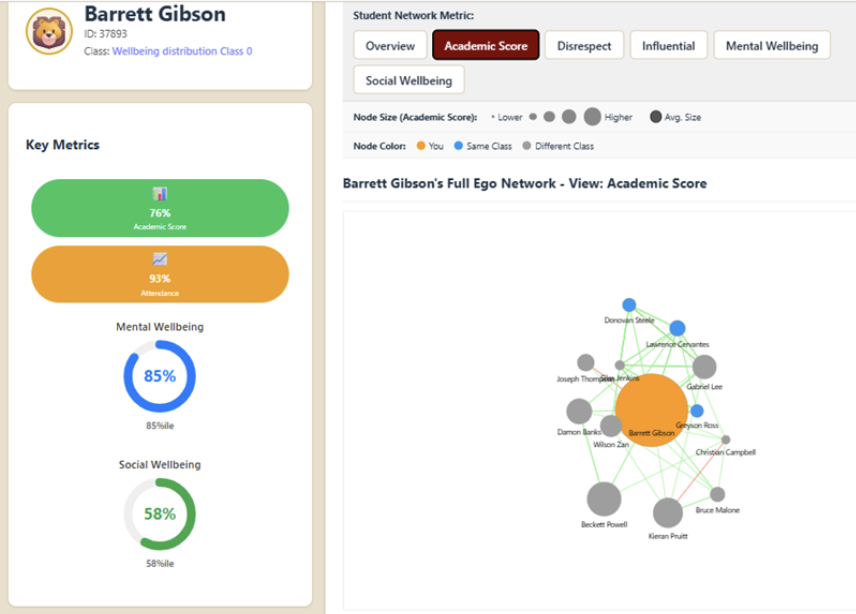
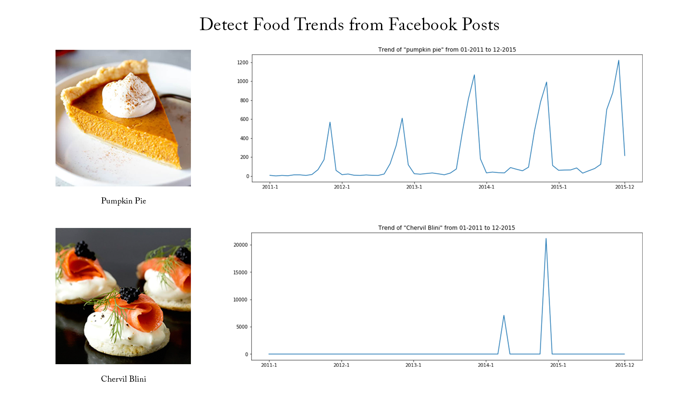
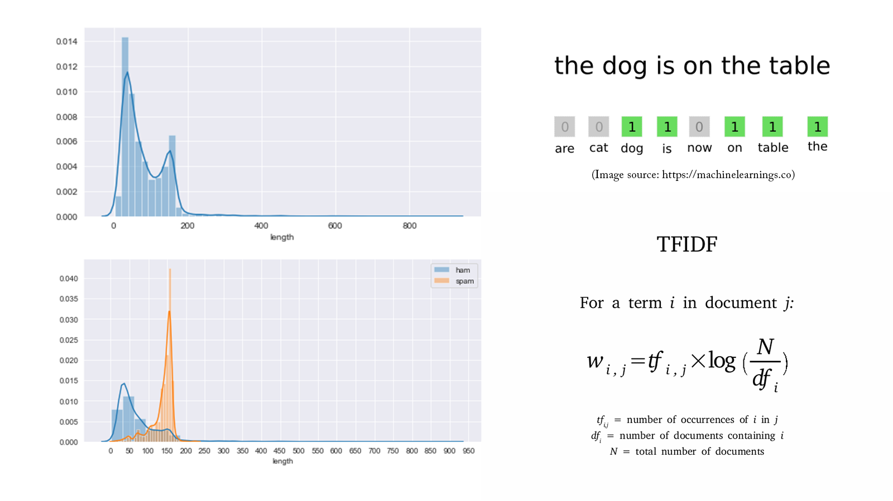
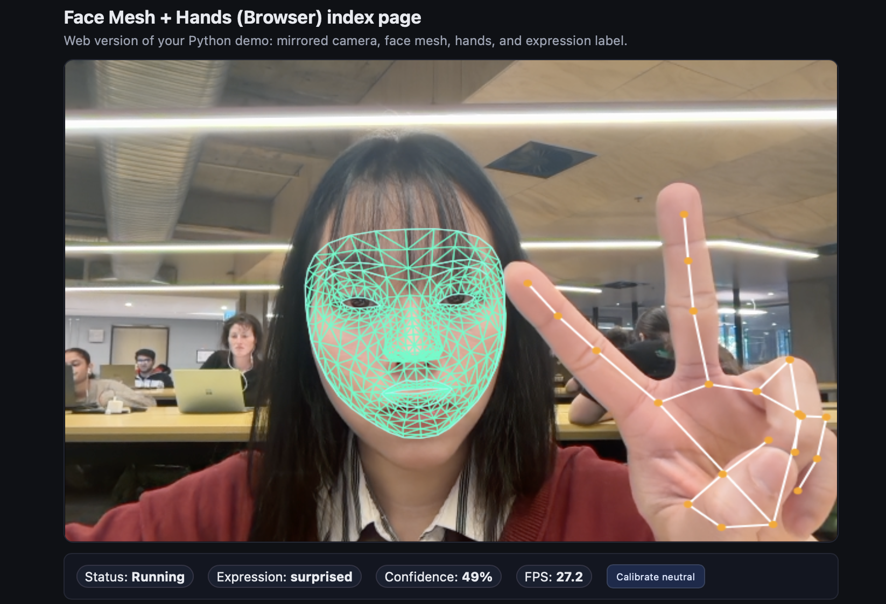
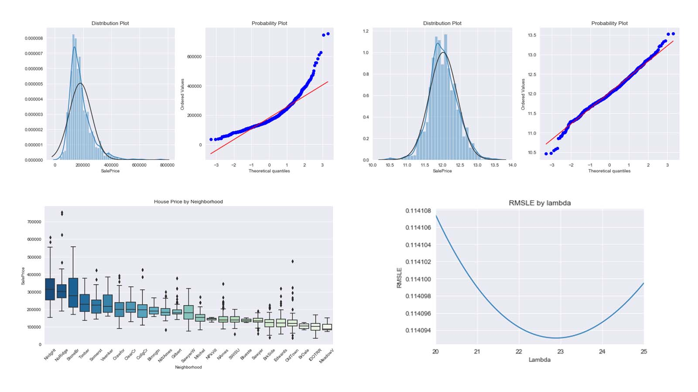
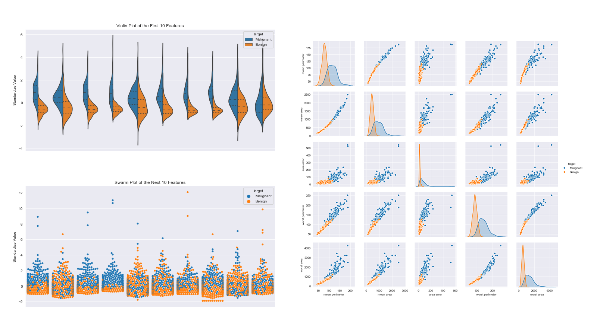
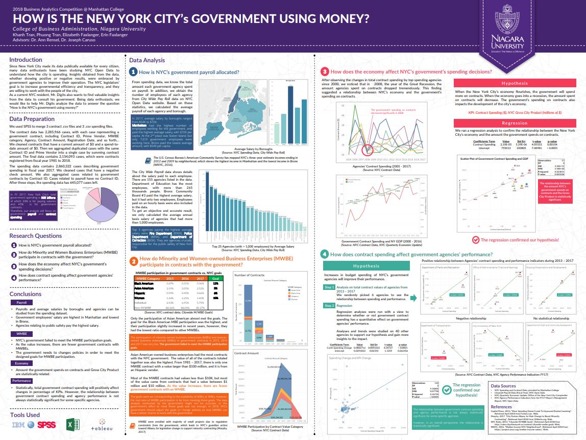

# Portfolio
---
## Graph Neural Network

### Classrooms allocation with Deep Learning

My complete implementation of assignments and projects in 

**Neural formular structure :** An GNN system which for the target relationship,This AI-powered system optimizes student classroom assignments by modeling social and academic dynamics through Graph Neural Networks (GNN) and Reinforcement Learning (RL). By treating students as nodes in a social graph, the system captures complex relationships—such as friendships and conflicts—to create balanced learning environments that traditional clustering methods often miss. Built with a FastAPI and React stack, it features an interactive dashboard for visualizing student networks and allows for real-time manual adjustments, ultimately automating the creation of classrooms that are both academically diverse and socially supportive. ([GitHub](https://github.com/chriskhanhtran/CS224n-NLP-Solutions/tree/master/assignments/)).

**Dependency Parsing:** A group allocation system base on GNN ([GitHub](https://github.com/chriskhanhtran/CS224n-NLP-Assignments/tree/master/assignments/a3)).

---
### Detect Ai by security auditor, LLM models

First I build This project investigates how psychological manipulation can be used to trigger prompt injection attacks in AI systems, filling a critical gap where no standardized risk framework currently exists. By utilizing an Agile and DevSecOpsmethodology, the team is developing a structured Risk Map and a Jupyter Notebook-based prototype to visually represent and quantify these vulnerabilities. The implementation includes an automated test suite with over seven test cases for models like Gemma 3 and Llama 3.1, alongside a JSON database of mitigation strategies to help organizations secure their AI workflows. Led by a team of six Data Science students and supervised by experts from CSIRO’s Data61, the project aims to deliver actionable security insights and a functional risk assessment dashboard by October 2025.

 

 

---
### Detect criminal: Pythorch

In order to predict whether a message is spam, first I vectorized text messages into a format that machine learning algorithms can understand using Bag-of-Word and TF-IDF. Then I trained a machine learning model to learn to discriminate between normal and spam messages. Finally, with the trained model, I classified unlabel messages into normal or spam.

 

 

## Data Engineering

FROM start to end, I have integrate IOT technologies to detect troubleshooting purpose by centralizing big data integreate with the modeling deloy through platform. Finally, we maintain the stucture of big data and improving all business 

---
## Data Science

### Credit Risk Prediction Web App

After my team preprocessed a dataset of 10K credit applications and built machine learning models to predict credit default risk, I built an interactive user interface with Streamlit and hosted the web app on Heroku server.

 

 

---
### Kaggle Competition: Predict Ames House Price using Lasso, Ridge, XGBoost and LightGBM

I performed comprehensive EDA to understand important variables, handled missing values, outliers, performed feature engineering, and ensembled machine learning models to predict house prices. My best model had Mean Absolute Error (MAE) of 12293.919, ranking <b>95/15502</b>, approximately <b>top 0.6%</b> in the Kaggle leaderboard.

 

 

---
### Predict Athlethe Performance by utralytrics

In this project I am going to perform comprehensive EDA on the breast cancer dataset, then transform the data using Principal Components Analysis (PCA) and use Support Vector Machine (SVM) model to predict whether a patient has breast cancer.

 

 

---
### Business Analytics Conference shopee 2018: How is ecommerce campaign sell predictions

In three-month research and a two-day hackathon, I led a team of four students to discover insights from 6 million records of NYC and Boston government spending data sets and won runner-up prize for the best research poster out of 18 participating colleges.

 

 

---
## Contented by me

Besides Data Science, I also have a great passion for content creation. Below is a list of technology and lystlye content,  documented to retain beautiful passion intregrate to my lifestlye and amazing people, environment, interest I met on the way.

 

- [In Australia, Melbourne - Study with me](https://www.youtube.com/watch?v=TcPSuanD7Hc&t=15s)

---

© 2026 Sally. Powered by Jekyll and the Minimal Theme.

